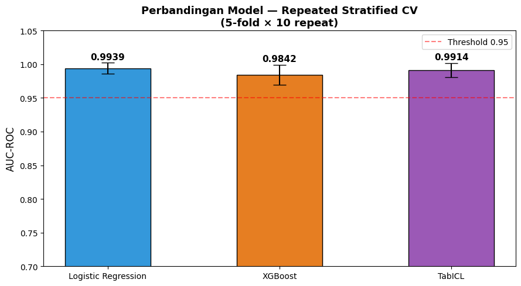
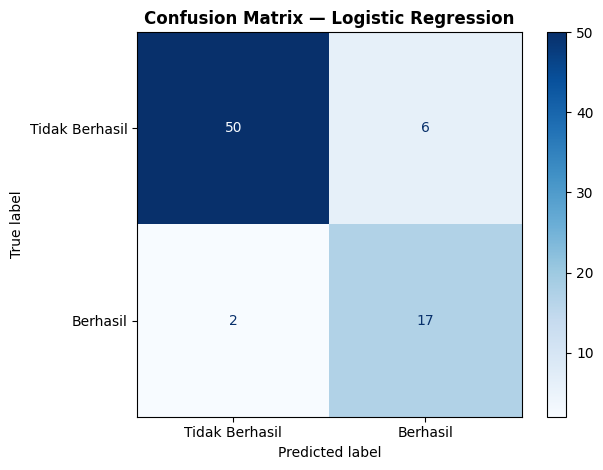
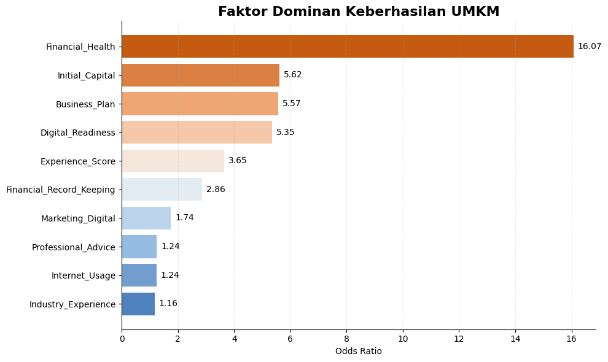
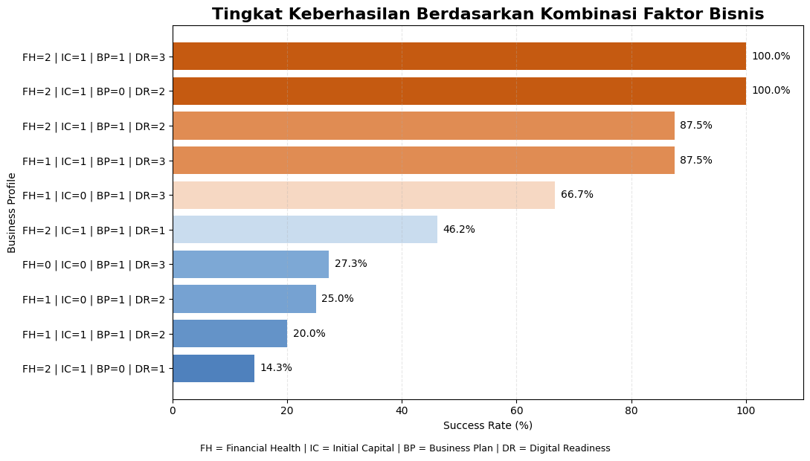

# Predicting UMKM Success Using Machine Learning


A machine learning project that predicts the success of Indonesian Micro, Small, and Medium Enterprises (UMKM) while identifying the key business factors influencing business success.

---
## ⭐ Project Highlights

- Developed and evaluated **4 machine learning models**.
- Performed **Repeated Stratified 5-Fold Cross Validation (10 repeats)** to improve evaluation robustness.
- Achieved **ROC AUC of 0.9939** during cross-validation using Logistic Regression.
- Generated business recommendations through feature importance analysis.

---

## 📖 Project Overview

Micro, Small, and Medium Enterprises (UMKM) contribute significantly to Indonesia's economy, yet many businesses struggle to achieve sustainable growth. Identifying the factors associated with business success can help entrepreneurs and policymakers make more informed decisions.

This project develops several machine learning models to predict whether an UMKM is likely to succeed based on business characteristics, financial practices, marketing activities, and digital adoption. Beyond predictive modeling, the project also analyzes the most influential features affecting business success and provides actionable business recommendations.

---

## 🎯 Objectives

- Predict the success of Indonesian UMKM using machine learning.
- Compare multiple machine learning algorithms.
- Identify the key factors influencing business success.
- Generate actionable business insights from model predictions.

---

## 📊 Dataset

The dataset contains approximately **250,000 UMKM records** with various demographic, financial, and business-related attributes.

### Target Variable

- **Success**
  - Successful
  - Not Successful

### Example Features

- Age
- Education
- Initial Capital
- Financial Record Keeping
- Internet Usage
- Marketing Effort
- Business Plan
- Business Experience
- Business Category
- Loan History

> **Note:** The original dataset is not included in this repository due to licensing restrictions.

---

## ⚙️ Methodology

The overall workflow of this project is as follows:

```
Data Collection
      │
      ▼
Exploratory Data Analysis
      │
      ▼
Feature Engineering
      │
      ▼
Train-Test Split
      │
      ▼
Model Training
      │
      ▼
Model Evaluation
      │
      ▼
Business Insights & Recommendations
```

---

## 🤖 Machine Learning Models

The following models were developed and evaluated:

- Logistic Regression
- Random Forest
- XGBoost
- TabICL

---
## 📈 Cross Validation Performance

Repeated Stratified 5-Fold Cross Validation (10 Repeats)

| Model | F1 Score | ROC AUC | Precision | Recall |
|------|---------:|---------:|---------:|---------:|
| Logistic Regression | **0.9444 ± 0.0439** | **0.9939 ± 0.0082** | **0.9545 ± 0.0329** | **0.9423 ± 0.0462** |
| XGBoost | 0.9341 ± 0.0414 | 0.9842 ± 0.0149 | 0.9381 ± 0.0385 | 0.9354 ± 0.0403 |
| TabICL | 0.9503 ± 0.0348 | 0.9914 ± 0.0103 | 0.9546 ± 0.0321 | 0.9503 ± 0.0351 |



---

## 🏆 Final Test Performance

The models were further evaluated on an unseen test set to assess their real-world predictive performance. While **TabICL** achieved the highest test accuracy and ROC AUC, **Logistic Regression** was selected as the primary model due to its consistently strong performance across repeated cross-validation, superior ROC AUC, and simpler, more interpretable decision boundaries.



### Test Set Comparison

| Model | Accuracy | F1 Score | ROC AUC |
|------|---------:|---------:|---------:|
| Logistic Regression | 89.33% | 89.64% | 0.9709 |
| TabICL | **90.67%** | **90.58%** | **0.9765** |

> **Model Selection:** Logistic Regression was chosen as the final model because it demonstrated more robust and consistent performance during repeated cross-validation while maintaining strong predictive performance on the unseen test set.

---

## 💡 Key Business Insights

Based on feature importance analysis, several factors strongly influence UMKM success:

- Maintaining proper financial records significantly increases the likelihood of business success.
- Internet utilization positively correlates with higher business performance.
- Consistent marketing efforts contribute substantially to successful businesses.
- Well-prepared business planning provides a competitive advantage.
- Initial capital alone is not sufficient without good business management practices.

### Feature Importance


### Success Rate by Key Business Factors


---

## 📁 Repository Structure

```
umkm-business-success-prediction/
│
├── data/
│   └── umkm.csv
│
├── notebooks/
│   └── umkm_analysis.ipynb
│
├── images/
│   ├── business_factor_based_success_rate.png
│   ├── confusion_matrix_lr.png
│   ├── repeated_stratified_cv_result.png
│   └── feature_importance.png
│
├── README.md
├── requirements.txt
├── LICENSE
└── .gitignore
```

---

## 🚀 Installation

Clone the repository

```bash
git clone https://github.com/JulianSudiyanto/umkm-business-success-prediction.git
```

Move into the project directory

```bash
cd umkm-business-success-prediction
```

Install dependencies

```bash
pip install -r requirements.txt
```

Open the notebook

```bash
jupyter notebook notebooks/umkm_analysis.ipynb
```

---

## 🛠️ Technologies Used

- Python
- Pandas
- NumPy
- Matplotlib
- Scikit-learn
- XGBoost
- CatBoost
- SciPy

---

## 🔮 Future Improvements

- Hyperparameter optimization using Bayesian Optimization or Optuna
- Deploy the model as a REST API using FastAPI
- Develop an interactive prediction dashboard
- Improve model interpretability using SHAP

---

## 👥 Acknowledgements

This project was developed as part of a machine learning competition focused on predicting the success of Indonesian Micro, Small, and Medium Enterprises (UMKM). The work was completed collaboratively with team members, while this repository serves as a portfolio showcasing the project and its methodology.